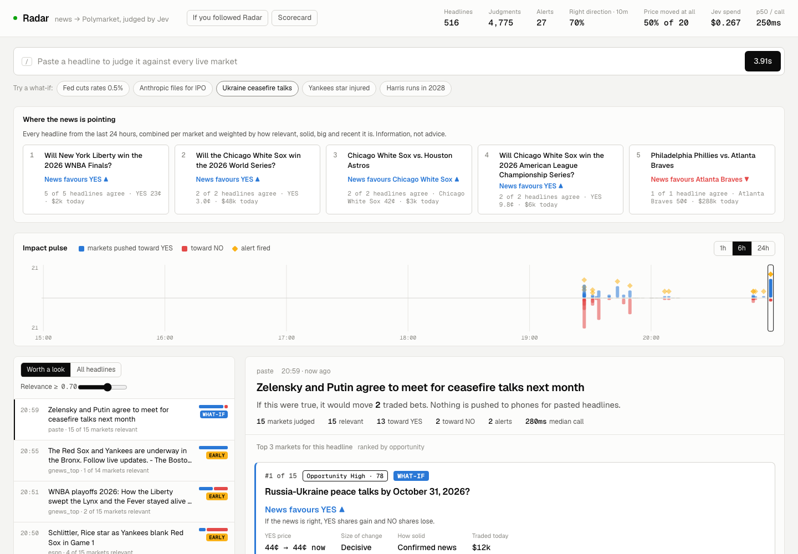
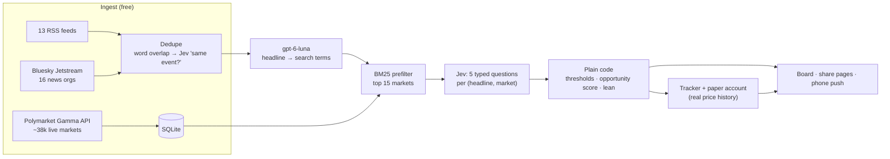
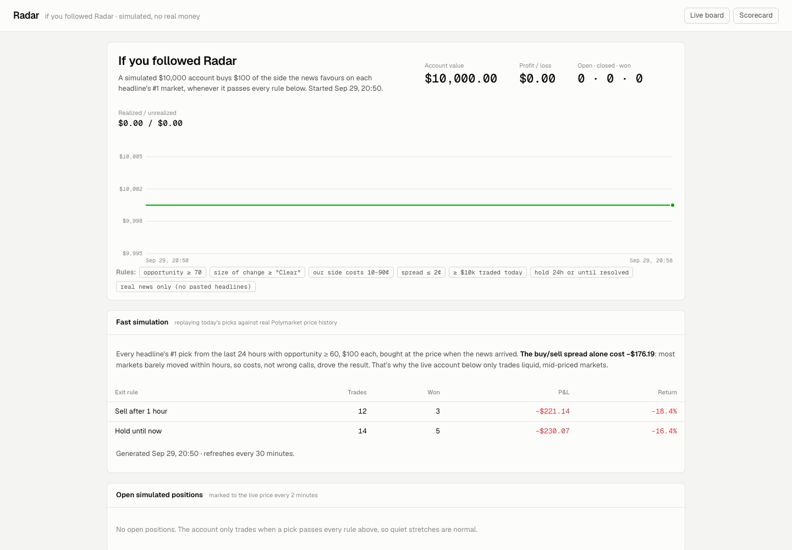

# Radar

**Breaking news, checked against the written rules of every live Polymarket market, in about a second.**
Radar tells you which bets a headline moves, which way, and whether the price has caught up yet. Then it keeps score, misses included.

**Live:** https://radar-production-d534.up.railway.app · [board](https://radar-production-d534.up.railway.app/board.html) · [if you followed Radar (simulated)](https://radar-production-d534.up.railway.app/paper.html) · [scorecard](https://radar-production-d534.up.railway.app/scorecard.html)



> Built in one long session (Sep 29–30, 2026) as a real-world test of [TypeSafe AI's Jev](https://docs.typesafe.ai), a "System One" model that returns typed, calibrated judgments instead of text. It's an experiment, not a trading product. Information, not advice.

---

## What it does

1. **Reads the news.** 13 RSS feeds and 16 news organisations on Bluesky's real-time firehose.
2. **Finds the bets it touches.** ~38,000 live Polymarket markets, narrowed to the 15 most likely per headline.
3. **Reads each market's resolution rules** and asks Jev five typed questions per pair.
4. **Decides in plain code** whether that's worth your attention, then ranks the markets.
5. **Shows it in plain English:** *"News favours YES · 44¢ at the headline → 44¢ now · Confirmed news · Early."*
6. **Keeps score:** re-checks every alert's price at +1/+5/+10/+60 min, and runs a paper-trading account that follows its own picks.

Example: *"Leon Edwards withdraws from UFC title fight with knee injury"* → *"Will Leon Edwards be the UFC Welterweight Champion on Dec 31?"* → **YES less likely**, confirmed news. And *"Xi Jinping hospitalised"* correctly does **not** fire on *"Will Xi be removed from power?"*: same person, different condition. That rules-vs-topic distinction is the whole point.

## Architecture



One Python process tree (`scripts/run_all.sh`): market sync, RSS poller, Bluesky listener, judge worker, price tracker, paper trader, FastAPI + Server-Sent Events. SQLite in WAL mode on a Railway volume. The frontend is plain HTML/JS with hand-built SVG charts: no framework, no build step.

## The technical decisions, and why

**1. A model that decides, not one that writes.** Every pair gets one Jev call with five questions answered in parallel:

| Question | Type | Why it exists |
|---|---|---|
| Would a trader of this market want to know this? | yes/no (probability) | relevance, written against the *rules*, not the topic |
| Is it about the same meeting / date / edition? | yes/no | Jev reads dates as text; this lets code veto "Fed cut in October" vs "December meeting" |
| What does it do to YES? | 1 of 5 | resolves YES · more likely · no effect · less likely · resolves NO |
| How big a change? | 3-level score | small · clear · decisive; feeds the ranking |
| How settled is the news? | 3-level score | speculation · developing · settled fact |

About 0.2 s and **~$0.00005 per call** (≈1,300 input tokens at $0.042 per million, output free). A generative LLM doing the same would cost roughly 100× more and return prose I'd have to parse.

**2. Judgment in the model, policy in code.** Jev never decides whether to alert. `radar/alerts.py` and `radar/rank.py` apply thresholds and weights over stored answers, so tuning never needs a re-run. Opportunity score = `.30 impact + .20 room-to-move + .15 solidity + .15 24h-volume + .10 relevance + .10 freshness`, with room capped by impact (a small nudge on a 3¢ long shot isn't a 97¢ opportunity).

**3. Keep the model away from its known weak spots.** Jev's docs list counting, arithmetic, dates and prompt injection as rough edges. So price-threshold markets ("BTC between $78k and $80k") never reach it; "exactly N" markets can't auto-resolve; dates are gated in code; headlines are fenced as data in the LLM prompts.

**4. Cheap LLM only where text is the product.** gpt-6-luna (reasoning off, ~1.3 s) does two jobs: expanding a headline into search terms before BM25 ("Vikings QB out" → "NFC North, win total, playoffs"), and one "why" sentence per alert. Never on the per-market path.

**5. Measure before believing.** A 100-pair labelled eval, with labels written by a different model (Codex) to keep it independent. Rewording one question moved recall from **0.55 → 0.93 at precision 1.00**: the first wording missed indirect news like a QB injury against a playoff market.

| Prompt version | Precision (rel ≥ 0.7) | Recall | Effect direction | Strength match |
|---|---|---|---|---|
| v1 "reports on the deciding condition" | 1.00 | 0.55 | 40/40 | 8/40 |
| v2 "would a trader of this market want to know" | **1.00** | **0.93** | 39/40 | 29/40 |

Every judgment stores its prompt version, so live results split cleanly by version on the scorecard.

**6. Be honest about outcomes, in the product.** A flat price isn't a wrong call, so the board reports *direction right when the price moved* (~70% live, small sample) separately from *did the price move at all* (~50%). Alerts age from **Early** to **No reaction** after 30 quiet minutes. Pasted headlines are labelled **What-if** and never pushed.

**7. Cost engineering.** 40 → 15 candidates per headline, a $1/day cap on feed spend, dedupe before judging, and an **on-demand mode**: ingest, prices, tracking and paper trading (all free) run continuously, while Jev and the LLM run only for a few headlines an hour plus whatever a visitor clicks. Results are cached, so nobody pays twice (second request: 3 ms).

## What the data said (the useful part)

The fast simulation replays each headline's #1 pick against Polymarket's real price history, $100 per trade with half the bid-ask spread charged each way:

| Exit rule | Trades | Result |
|---|---|---|
| Sell after 1 hour | 12 | **−18.4%** |
| Hold until now | 22 | **−14.5%** |

**$287 of the $319 loss was the spread.** Markets rarely moved within hours, so the signal didn't pay for the round trip, and 1–3¢ long shots were worst (−45%). The live paper account now runs a stricter rule, fixed *before* seeing results: opportunity ≥ 70, a "clear" change or bigger, our side priced 10–90¢, spread ≤ 2¢, ≥ $10k traded that day, hold 24h or until resolved. If it still loses after a couple of weeks, the trading thesis is dead and Radar is a monitoring tool. That's fine too.



## Run it

```bash
python3 -m venv .venv && . .venv/bin/activate && pip install -r requirements.txt
echo "TYPESAFE_API_KEY=..." >> .env        # required
echo "OPENAI_API_KEY=..."   >> .env        # optional: search terms + why lines
bash scripts/run_all.sh                     # http://127.0.0.1:8000
```

Useful knobs: `RADAR_MODE=on_demand`, `RADAR_AUTO_PER_HOUR=4`, `RADAR_PREFILTER_K=15`, `RADAR_DAILY_CAP_USD=1`, `PUBLIC_MODE=1` (rate-limits pastes), `RADAR_LLM_MODEL=gpt-6-luna`. Evals: `python -m eval.run_eval`. Backtest: `python -m radar.paper --backtest`.

**Deploy (Railway):** `railway.json` and `railpack.json` run `scripts/run_all.sh`. Set `HOST=0.0.0.0`, `RADAR_DB=/data/radar.db`, and a volume at `/data`.

## Map of the code

| Path | What |
|---|---|
| `radar/judge.py` | the five Jev questions (the prompt design lives here) |
| `radar/match.py` | dedupe → search terms → BM25 prefilter → parallel Jev calls → alerts |
| `radar/rank.py` | opportunity score and per-market weighted news lean |
| `radar/alerts.py` | alert policy: all thresholds in one place |
| `radar/paper.py` | backtest on real price history + live paper account |
| `radar/markets.py`, `radar/news/` | Polymarket indexer (keyset pagination), RSS, Bluesky Jetstream |
| `api/server.py` | FastAPI, SSE stream, share pages with link previews, rate limits |
| `web/` | landing + explainer film, board, scorecard, paper page |
| `eval/` | labelled pairs, eval runner, results, feedback → new eval pairs |

## Limits

- News arrives 1–10 minutes after it breaks; fast traders on X win the big stories. The edge, if any, is breadth: thousands of markets nobody watches.
- The eval set is 100 synthetic pairs from one model; live accuracy has to come from the scorecard over weeks.
- Polymarket availability depends on where you live. Nothing here is trading advice.

---
Built by Shubham Joshi with Claude Code (orchestration, backend, eval) and Codex (API server, tracker, eval labels). Judgments by [TypeSafe Jev](https://docs.typesafe.ai); market data from Polymarket's public APIs.
